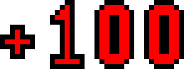

# click-bug
 Um jogo feito para aprender melhor ```JavaScript```

### Linguagens utilizadas:

<br>

- HTML
- CSS
- JavaScript

<br>

### Etapas do ```desenvolvimento```:

<br>

#### Estrutura ``css``

~~~css

    html,
    body {
        height: 100%;
    }

    #quadro {
        height: 80%;
        position: relative;
        overflow: hidden;
        background-image: url('imagens/bg.png');
        background-size: cover;
    }

    #score {
        position: absolute;
        top: 10px;
        right: 10px;
        width: fit-content;
        z-index: 100;
        color: #600;
        font-weight: bold;
        font-size: 30px;
    }

    .invasor,
    .bonzinho {
        position: absolute;
        left:  -400px;
        width: 80px;
        height: 80px;
        background-image: url('imagens/invasor.png');
    }

    .bonzinho {
        background: none;
        background-color: rgba(220, 20, 143, 0.425);
    }

    #pts100 {
        display: block;
        width: 50px;
        position: absolute;
        left: -300px;
        top: 300px;
    }

~~~

<br>

#### Estrutura ``HTML``

~~~html
<!DOCTYPE html>
<html lang="pt-BR">

<head>
    <meta charset="UTF-8">
    <meta http-equiv="X-UA-Compatible" content="IE=edge">
    <meta name="viewport" content="width=device-width, initial-scale=1.0">
    <title>Mata Mata</title>

    <link href="https://cdn.jsdelivr.net/npm/bootstrap@5.0.2/dist/css/bootstrap.min.css" rel="stylesheet"
        integrity="sha384-EVSTQN3/azprG1Anm3QDgpJLIm9Nao0Yz1ztcQTwFspd3yD65VohhpuuCOmLASjC" crossorigin="anonymous">
</head>

<body id="jogo">

    
    <div class="d-flex align-items-center h-100">
        <div id="quadro" class="col-md-10 offset-md-1 border border-secondary">
            <div id="contagem"><span id="infoTR" class="fw-bold"></span>
                segundos. Tempo restante: <span id="temporest"></span>
            </div>
            <div id="score"></div>
            <div id="inv1" class="invasor"></div>
            <div id="inv2" class="invasor"></div>
            <div id="inv3" class="invasor"></div>
            <div id="inv4" class="invasor"></div>
            <div id="inv5" class="invasor"></div>
            <div id="bom1" class="bonzinho"></div>
            <div id="bom2" class="bonzinho"></div>

            
        </div>
    </div>


    <script src="https://cdn.jsdelivr.net/npm/bootstrap@5.0.2/dist/js/bootstrap.bundle.min.js"
        integrity="sha384-MrcW6ZMFYlzcLA8Nl+NtUVF0sA7MsXsP1UyJoMp4YLEuNSfAP+JcXn/tWtIaxVXM"
        crossorigin="anonymous"></script>

    <script src="game.js"></script>
</body>

</html>


~~~
<br>

estrutura ``js``
~~~js
/*
-------------------------------------------------
 Funçôes
-------------------------------------------------
*/

/*Função para posicionar o elemento na tela,
Recebe o parametro el que informa qual elemento,
qual o elemento se desloca*/
const posicElemento = (el) => {
    //sorteia um numero p/ os posicionamentos
    let posX = Math.floor(Math.random() * 960 + 40)
    let posY = Math.floor(Math.random() * alturaQuadro / 2 + 40)

    //Posiciona o elemento na tela
    el.style.position = 'absolute'
    el.style.left = -posX + 'px'
    el.style.top = posY + 'px'
}

/*Funçâo para deslocar os elementos na tela
Paramentros de elemento, velocidade e incremendo */
const moveElemento = (el, veloc, inc) => {
    //setInterval - repete funçâo constantemente
    const anima = setInterval(() => {
        veloc = veloc + inc
        el.style.left = veloc + 'px'

        //verfica se sai da tela e faz o retorno
        //Tbm verifica se possui a classe "morto" e ent executa o comando acima ^
        if (veloc > larguraQuadro || el.classList.contains("morto")) {
            //Redefine a velocidade e incremento
            veloc = -Math.random() * 400 + 80
            inc = Math.random() * 20 + 5
            posicElemento(el)
            //remove a classe "morto" do elemento
            el.classList.remove('morto')
        }
        //Adiciona atributo "velocidade"
        //aos elementos com o valor de incremento
        el.setAttribute('velocidade', inc)

    }, 40)

    //parar interval
    //clearInterval(anima)

}

~~~

<br>

<h3> Feito apenas para <strong>aprender</strong> js </h3>


